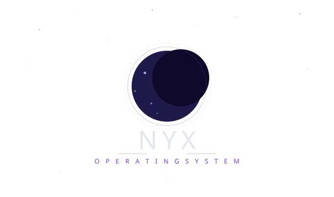

<div align="center">



**A hobby x86_64 operating system built from scratch**

*Created by [Intuex](https://github.com/Intuex)*


</div>

---

## About

Nyx OS is a 64-bit hobby operating system written in C and x86 Assembly, built entirely from scratch. Named after the Greek goddess of the night, Nyx aims to be a clean, minimal kernel with a focus on understanding how operating systems work at a fundamental level.

---

## Features

- Multiboot-compliant bootloader (GRUB)
- 64-bit long mode with custom GDT
- IDT with hardware interrupt support
- PIC (8259) initialization and masking
- PS/2 keyboard driver with key event handling
- RTC (Real Time Clock) driver
- VGA text mode output with color support
- Physical Memory Manager (PMM) with bitmap allocator
- Custom port I/O abstraction

---

## Project Structure

```
nyx-os/
├── src/
│   ├── impl/
│   │   ├── kernel/
│   │   │   └── main.c          # Kernel entry point
│   │   └── x86_64/
│   │       ├── boot/
│   │       │   ├── header.asm  # Multiboot header
│   │       │   ├── main.asm    # 32-bit bootstrap
│   │       │   └── main64.asm  # 64-bit entry
│   │       ├── idt.c           # Interrupt descriptor table
│   │       ├── keyboard.c      # PS/2 keyboard driver
│   │       ├── pic.c           # Programmable interrupt controller
│   │       ├── port.c          # Port I/O
│   │       ├── print.c         # VGA text output
│   │       ├── pmm.c           # Physical memory manager
│   │       └── rtc.c           # Real time clock
│   └── intf/
│       └── x86_64/             # Header files
├── targets/
│   └── x86_64/
│       └── linker.ld           # Linker script
├── buildenv/
│   └── Dockerfile              # Cross-compiler build environment
├── logo.svg                    # Project logo
└── Makefile
```

---

## Building

Nyx OS uses a Dockerized cross-compiler environment to keep builds consistent.

### Prerequisites

- [Docker](https://www.docker.com/)
- [QEMU](https://www.qemu.org/) (for running)
- [NASM](https://www.nasm.us/)

### Build

```bash
# Build the Docker cross-compiler environment (first time only)
docker build -t nyx-os buildenv/

# Run the build container
docker run --rm -it -v $(pwd):/root/env nyx-os

# Inside the container
make build-x86_64
```

### Run

```bash
qemu-system-x86_64 -cdrom dist/x86_64/kernel.iso
```

---

## Roadmap

- [x] Multiboot + long mode bootstrap
- [x] GDT / IDT
- [x] VGA text output
- [x] PS/2 keyboard input
- [x] PIC & hardware interrupts
- [x] Physical Memory Manager (PMM)
- [ ] Virtual Memory Manager (VMM)
- [ ] Heap allocator (`malloc` / `free`)
- [ ] Basic filesystem
- [ ] Userspace / syscalls
- [ ] ELF loader

---

## License

[Intuex](https://github.com/Intuex)

---

<div align="center">
<sub>Built with curiosity, caffeine, and too many triple faults.</sub>
</div>
